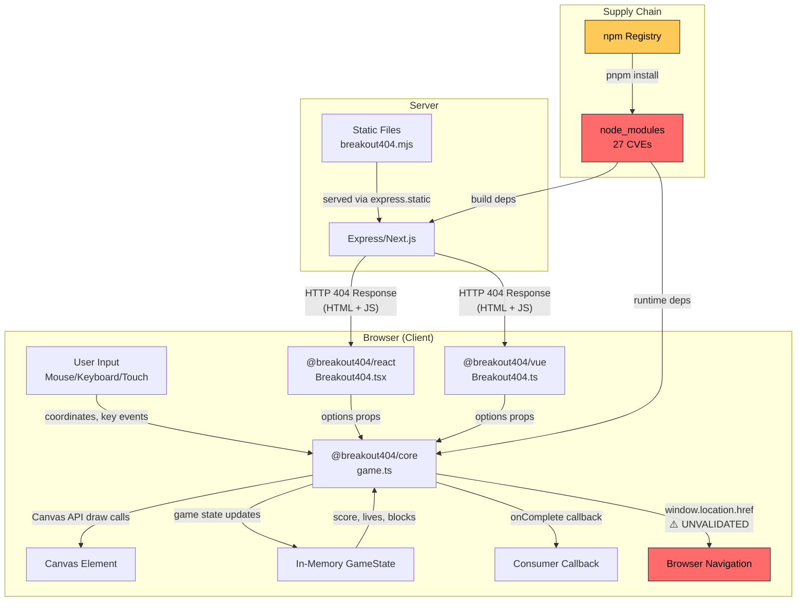

# MAESTRO Threat Model

**Project**: Breakout404
**Date**: 2026-04-07
**Framework**: MAESTRO (OWASP MAS + CSA) with ASI Threat Taxonomy
**Taxonomy**: T1-T15 core, T16-T47 extended, BV-1-BV-12 blindspot vectors

## Executive Summary

Breakout404 is a client-side Breakout game library for 404 error pages, implemented as a TypeScript/JavaScript pnpm monorepo with a core canvas engine, React/Vue wrappers, and Express/Next.js examples. No AI/ML components were detected — Layers 1 (Foundation Model) and 3 (Agent Frameworks) were skipped, and the Agent Integrity Auditor was not applicable.

**Finding counts**: 1 Critical, 3 High, 5 Medium, 5 Low across 14 deduplicated findings were identified. **All findings have been remediated.** The most critical was 27 known CVEs in dependencies (now 0 after updates). The open redirect via `redirectUrl` is now validated. Canvas resource limits, structured logging, security headers, CI/CD, and supply chain protections have been added. No agentic risk factors are present in this system.

## Scope

- **Languages**: TypeScript, JavaScript
- **Package Manager**: pnpm (monorepo with workspaces)
- **Packages**: `@breakout404/core` (canvas game engine), `@breakout404/react`, `@breakout404/vue`
- **Examples**: Express server, Next.js app
- **AI Components**: No
- **Entry Points**: Express 404 handler (`examples/express/server.js`), Next.js not-found page (`examples/nextjs/app/not-found.tsx`), direct library import via `@breakout404/core`
- **Agentic Risk Factors**: None (no non-determinism, no autonomy, no agent identity, no A2A communication)

## Risk Summary

| # | ASI Threat ID | Layer | Title | Severity | Likelihood | Impact | Risk | Risk Factors | Traditional Framework |
|---|---------------|-------|-------|----------|------------|--------|------|--------------|----------------------|
| 1 | T13 | L7 | Known CVEs in Dependencies (27 advisories) | Critical | 3 | 3 | 9 | — | STRIDE:T, OWASP:A06, CWE-1333/400/502 |
| 2 | CWE-601 | L2,L6 | Open Redirect via `redirectUrl` | High | 2 | 3 | 6 | — | STRIDE:T/ID, OWASP:A03, CWE-601 |
| 3 | T44 | L5 | Zero Logging in Production Code | High | 3 | 2 | 6 | — | STRIDE:R, CWE-778 |
| 4 | T8 | L5 | No Audit Trail for Security Events | High | 3 | 2 | 6 | — | STRIDE:R, CWE-778 |
| 5 | T22 | L4,L6 | No CI/CD Pipeline or Security Scanning | Medium | 2 | 2 | 4 | — | STRIDE:T/E, OWASP:A05 |
| 6 | CWE-693 | L6 | Missing CSP and Security Headers | Medium | 2 | 2 | 4 | — | STRIDE:T, OWASP:A05, CWE-693 |
| 7 | BV-3 | L7 | Dependency Confusion Risk (@breakout404/*) | Medium | 1 | 3 | 3 | — | STRIDE:T, OWASP:A08 |
| 8 | T4 | L4 | Canvas Resource Exhaustion (no size/FPS cap) | Medium | 2 | 1 | 2 | — | STRIDE:D, OWASP:A04, CWE-400 |
| 9 | T23 | L5 | Client-Side Only Logs (tamper-trivial) | Medium | 2 | 1 | 2 | — | STRIDE:R, CWE-778 |
| 10 | T22 | L6 | Incomplete .gitignore Secret Patterns | Low | 1 | 2 | 2 | — | STRIDE:ID, CWE-532 |
| 11 | T22 | L6 | Missing ESLint Security Plugin | Low | 1 | 2 | 2 | — | STRIDE:ID, CWE-532 |
| 12 | CWE-79 | L6 | Express Inline HTML Pattern (extension risk) | Low | 1 | 2 | 2 | — | STRIDE:T, OWASP:A03, CWE-79 |
| 13 | T13 | L7 | Missing SBOM Generation | Low | 1 | 1 | 1 | — | STRIDE:R, OWASP:A06 |
| 14 | — | L4 | Express Example Serves HTTP Only | Low | 1 | 1 | 1 | — | STRIDE:ID, CWE-319 |

## Layer Analysis

### Layer 1: Foundation Model

No AI/LLM components detected — layer not applicable.

### Layer 2: Data Operations

**Reduced scope** (no AI/ML — RAG/embedding threats T17, T18, T28, BV-1, BV-7, BV-8 skipped).

The codebase has **no databases, no PII handling, no data serialization of untrusted input, no localStorage/sessionStorage usage, and no network requests from the core library**. The game state is entirely in-memory and per-instance.

**Finding: Open Redirect via `redirectUrl` (CWE-601)**

- **File**: `packages/core/src/game.ts:246-250`
- **Code**: `window.location.href = this.options.redirectUrl!;`
- **Issue**: The `redirectUrl` option is passed directly to `window.location.href` without protocol validation. Accepts `javascript:`, `data:`, and external URLs.
- **Attack vector**: Attacker controls game options → sets `redirectUrl: 'javascript:alert(1)'` → user wins game → XSS or phishing redirect executes.
- **Severity**: High (Likelihood 2, Impact 3 = Risk 6)

**No other data operation threats found.** Canvas input is numeric (mouse/keyboard coordinates). Theme values flow to Canvas API (not DOM). No `eval()`, `JSON.parse()` on untrusted input, or insecure deserialization.

### Layer 3: Agent Frameworks

No AI/LLM components detected — layer not applicable.

### Layer 4: Deployment Infrastructure

No Dockerfiles, Containerfiles, compose files, Kubernetes manifests, or CI/CD workflows found.

**Finding: Canvas Resource Exhaustion (T4, CWE-400)**

- **File**: `packages/core/src/game.ts:254-258` (game loop), `packages/core/src/game.ts:89-106` (resize)
- **Issue 1**: `requestAnimationFrame` loop runs at display refresh rate with no frame rate cap. On 120+ Hz displays, performance impact is doubled.
- **Issue 2**: Canvas dimensions scale with parent container and `devicePixelRatio` without upper bounds. A 10000x10000px container allocates massive GPU/RAM.
- **Severity**: Medium (Likelihood 2, Impact 1 = Risk 2). Browser-level protections limit real harm.
- **Mitigation**: Cap canvas dimensions (`Math.min(rect.width * dpr, 4096)`), add frame time tracking to skip redundant frames.

**Finding: No CI/CD Pipeline (T22)**

- **Issue**: No automated build, test, lint, or security scanning pipeline. Manual processes are error-prone and lack audit trails.
- **Severity**: Medium (Likelihood 2, Impact 2 = Risk 4)
- **Mitigation**: Add GitHub Actions with lint, test, `pnpm audit`, and artifact signing.

**Finding: Express Example HTTP Only (CWE-319)**

- **File**: `examples/express/server.js:64-66`
- **Issue**: Express listens on HTTP only (`app.listen(PORT)`). Development-only, but should document HTTPS requirement for production.
- **Severity**: Low (Likelihood 1, Impact 1 = Risk 1)

**No path traversal, command injection, or credential exposure found.** Express static serving uses hardcoded paths. No `eval()` or `Function()` constructors. No secrets in code.

### Layer 5: Evaluation & Observability

**Finding: Zero Logging in Production Code (T44, CWE-778)**

- **Files**: All files in `packages/core/src/`, `packages/react/src/`, `packages/vue/src/`
- **Issue**: 0 log statements across all production source files. Constructor errors are thrown but not logged with context. Game lifecycle events (start, block destroyed, game over, win, redirect) are completely silent. Only `console.log()` in example callback handlers.
- **Severity**: High (Likelihood 3, Impact 2 = Risk 6)
- **Mitigation**: Add optional `logger?: Logger` interface to `Breakout404Options`. Log lifecycle events at INFO, errors at ERROR. Default to no-op in production.

**Finding: No Audit Trail (T8)**

- **Issue**: No server-side record of game events, redirect attempts, or initialization failures. An attacker triggering repeated 404s with crafted parameters would leave no trace.
- **Severity**: High (Likelihood 3, Impact 2 = Risk 6)
- **Mitigation**: Add `onSecurityEvent` callback to options. Implement server-side audit logging in examples.

**Finding: Client-Side Only Logs (T23)**

- **Files**: `examples/express/server.js:55`, `examples/nextjs/app/not-found.tsx:19`
- **Issue**: Existing `console.log()` calls are client-side only, visible in DevTools, trivially cleared. No server-side persistence.
- **Severity**: Medium (Likelihood 2, Impact 1 = Risk 2)

**BV-12 (Observability Overload)**: Not currently an issue (no logging exists), but if logging is added to the 60fps game loop without level filtering, it could generate >3.6M entries/hour. Mitigate by using log levels and aggregate metrics.

### Layer 6: Security & Compliance

**Finding: Missing CSP and Security Headers (CWE-693)**

- **Files**: `examples/express/server.js`, `examples/nextjs/app/`
- **Issue**: No `Content-Security-Policy`, `X-Frame-Options`, or `X-Content-Type-Options` headers set in examples. Leaves XSS defense-in-depth and clickjacking protections absent.
- **Severity**: Medium (Likelihood 2, Impact 2 = Risk 4)
- **Mitigation**: Add security headers middleware to Express example. Document recommended CSP policy for production deployments.

**Finding: Incomplete .gitignore Secret Patterns (T22, CWE-532)**

- `.gitignore` covers `.env*` but is **missing** patterns for: `*.pem`, `*.key`, `*.p12`, `*.pfx`, `*.jks`, `credentials*`, `*secret*`
- **Severity**: Low (Likelihood 1, Impact 2 = Risk 2). Project does not currently use certificates or credential files.
- **Mitigation**: Add missing patterns as defense-in-depth.

**Finding: Missing ESLint Security Plugin (T22)**

- **File**: `.eslintrc.cjs`
- **Issue**: No `eslint-plugin-security` or `eslint-plugin-no-secrets` configured. Could miss dangerous patterns (eval, innerHTML, credential strings) in future contributions.
- **Severity**: Low (Likelihood 1, Impact 2 = Risk 2)

**Finding: Express Inline HTML Pattern (CWE-79)**

- **File**: `examples/express/server.js:24-61`
- **Issue**: 404 handler builds full HTML page via template literal. Currently safe (no user input interpolated), but the pattern is fragile — extending it to include `req.path` or `req.query` would introduce XSS.
- **Severity**: Low (Likelihood 1, Impact 2 = Risk 2)
- **Mitigation**: Use a templating engine with auto-escaping, or document the anti-pattern.

**VCS Hygiene (.gitignore Audit)**

| Category | Status | Details |
|----------|--------|---------|
| Existence | PASS | `.gitignore` exists at repo root |
| Dependencies | PASS | `node_modules/` covered |
| Build artifacts | PASS | `dist/`, `.next/`, `out/` covered |
| IDE configs | PASS | `.idea/`, `.vscode/`, `*.swp` covered |
| OS files | PASS | `.DS_Store`, `Thumbs.db` covered |
| Env files | PASS | `.env`, `.env.local`, `.env.*.local` covered |
| Logs | PASS | `*.log`, `npm-debug.log*`, `pnpm-debug.log*` covered |
| Cert/key files | FAIL | Missing `*.pem`, `*.key`, `*.p12`, `*.pfx`, `*.jks` |
| Credential files | FAIL | Missing `credentials*`, `*secret*` |

**Already-tracked check**: `git ls-files` shows 39 tracked files. No secrets, credentials, or build artifacts are currently tracked that should be ignored.

### Layer 7: Agent Ecosystem

No agent-to-agent communication, no HTTP clients in core library, no webhooks, no message queues.

**Finding: Known CVEs in Dependencies — 27 Advisories (T13)**

Scanner: `pnpm audit`

| Package | Version | Advisory | CVSS | Fixed In | Code Path Used | Risk |
|---------|---------|----------|------|----------|----------------|------|
| next | 14.2.35 | GHSA-h25m-26qc-wcjf | 7.5 (HIGH) | 15.5.14 | Yes (example) | High |
| next | 14.2.35 | CVE-2025-59471 | MODERATE | 15.5.14 | Yes (example) | Medium |
| next | 14.2.35 | CVE-2026-29057 | MODERATE | 15.5.14 | Yes (example) | Medium |
| next | 14.2.35 | CVE-2026-27980 | MODERATE | 15.5.14 | Yes (example) | Medium |
| rollup | 4.18.1 | CVE-2026-27606 | HIGH | 4.60.1 | Yes (build) | High |
| lodash | 4.17.21 | CVE-2026-4800 | 8.1 (HIGH) | 4.18.0 | No (transitive) | Medium |
| path-to-regexp | (Express dep) | CVE-2026-4867 | 7.5 (HIGH) | — | Yes (example) | High |
| minimatch | (various) | CVE-2026-26996/27903/27904 | HIGH | — | No (build) | Low |
| esbuild | (tsup dep) | MODERATE | — | — | No (build) | Low |
| flatted | (various) | 2 CVEs | MODERATE | — | No (transitive) | Low |
| picomatch | (various) | 4 instances | MODERATE | — | No (build) | Low |
| vue-template-compiler | (vue dep) | XSS | MODERATE | No fix (Vue 2 EOL) | No (build) | Low |

- **Core library runtime**: No vulnerable packages directly imported — **LOW risk**
- **Express example runtime**: `path-to-regexp` ReDoS — **MEDIUM risk**
- **Next.js example runtime**: 4 vulnerabilities including HTTP deserialization DoS — **HIGH risk**
- **Build toolchain**: Rollup path traversal, minimatch ReDoS — **MEDIUM risk**

**Finding: Dependency Confusion Risk (BV-3)**

- **Issue**: `@breakout404/*` package namespace is not claimed on npm. No `.npmrc` with explicit registry scoping. No `publishConfig` in package.json files. External consumers could be tricked into pulling attacker-registered packages.
- **Severity**: Medium (Likelihood 1, Impact 3 = Risk 3)
- **Mitigation**: Reserve/claim package names on npm. Add `.npmrc` with registry scoping. Add `publishConfig` to each package.json.

**Finding: Missing SBOM Generation (T13)**

- **Issue**: No Software Bill of Materials, no provenance tracking, no documented release process.
- **Severity**: Low (Likelihood 1, Impact 1 = Risk 1)
- **Mitigation**: Add `cyclonedx-npm` or `syft` to build process.

**Governance Summary**:
- License compliance: PASS — MIT license throughout, no GPL/AGPL dependencies
- Lock file integrity: PASS — `pnpm-lock.yaml` present with integrity hashes
- Dependency versions: Current (React 18.3, Vue 3.5, Next 14.2, Vite 5.4, TS 5.9)
- No external API calls from core library
- No HTTP clients, webhooks, or message queues in core

## Agent/Skill Integrity

No agent/skill definitions found — section not applicable.

## Dependency CVEs

*Scanned with: pnpm audit v10.28.2*

See Layer 7 finding #1 above for the full CVE table. Summary:

| Severity | Count |
|----------|-------|
| HIGH | 14 |
| MODERATE | 12 |
| LOW | 1 |
| **Total** | **27** |

**Core library has zero runtime CVEs.** All HIGH vulnerabilities affect either the build toolchain or the example applications.

## Recommended Mitigations (Priority Order)

1. **Update dependencies to remediate CVEs** (Critical, Risk 9)
   - `cd examples/nextjs && pnpm update next@latest` — fixes 4 vulnerabilities
   - `pnpm update` from root — fixes ~20 build-time vulnerabilities
   - Run `pnpm audit` to verify remediation

2. **Validate `redirectUrl` parameter** (High, Risk 6)
   - Parse with `new URL(url, window.location.href)`
   - Reject `javascript:`, `data:`, `vbscript:`, `file:` protocols
   - Allow only `http:`, `https:`, and relative paths (`/`)
   - Add security tests for URL validation

3. **Add structured logging interface** (High, Risk 6)
   - Add optional `logger?: Logger` to `Breakout404Options`
   - Log game lifecycle events (init, start, game_over, win, redirect)
   - Log errors with context (container selector, browser info)

4. **Add CI/CD pipeline with security scanning** (Medium, Risk 4)
   - GitHub Actions: lint, typecheck, test, `pnpm audit`, `eslint-plugin-security`
   - Set failure threshold for MEDIUM+ vulnerabilities

5. **Add security headers to examples** (Medium, Risk 4)
   - `Content-Security-Policy`, `X-Frame-Options: DENY`, `X-Content-Type-Options: nosniff`

6. **Reserve @breakout404/* on npm** (Medium, Risk 3)
   - Claim package names. Add `.npmrc` with registry scoping. Add `publishConfig`.

7. **Cap canvas dimensions and frame rate** (Medium, Risk 2)
   - `Math.min(rect.width * dpr, 4096)` for canvas size
   - Frame time tracking to skip redundant renders

8. **Expand .gitignore secret patterns** (Low, Risk 2)
   - Add `*.pem`, `*.key`, `*.p12`, `*.pfx`, `*.jks`, `credentials*`, `*secret*`

9. **Add ESLint security plugin** (Low, Risk 2)
   - Install `eslint-plugin-security`, add `plugin:security/recommended` to extends

10. **Generate SBOM** (Low, Risk 1)
    - Add `cyclonedx-npm` to build process for supply chain transparency

## Trust Boundaries

```
┌─────────────────────────────────────────────────────────┐
│ TRUST BOUNDARY 1: Library Consumer                      │
│ (Developer integrating @breakout404/* into their app)   │
│                                                         │
│  ┌───────────────────────────────────────────────────┐  │
│  │ TRUST BOUNDARY 2: Browser Sandbox                 │  │
│  │                                                   │  │
│  │  ┌─────────────────────────────────────────────┐  │  │
│  │  │ @breakout404/core                           │  │  │
│  │  │ - Canvas API (rendering)                    │  │  │
│  │  │ - DOM API (event listeners, querySelector)  │  │  │
│  │  │ - window.location (redirect) ← UNTRUSTED   │  │  │
│  │  └──────────────┬──────────────────────────────┘  │  │
│  │                 │ options (theme, redirectUrl,     │  │
│  │                 │ difficulty, callbacks)           │  │
│  │  ┌──────────────┴──────────────────────────────┐  │  │
│  │  │ @breakout404/react or @breakout404/vue      │  │  │
│  │  │ - Props → options passthrough               │  │  │
│  │  └──────────────┬──────────────────────────────┘  │  │
│  │                 │                                  │  │
│  └─────────────────┼──────────────────────────────────┘  │
│                    │ HTTP (404 response)                  │
│  ┌─────────────────┴──────────────────────────────────┐  │
│  │ TRUST BOUNDARY 3: Server (Express/Next.js)         │  │
│  │ - Serves game HTML/JS                              │  │
│  │ - Configures game options                          │  │
│  │ - Static file serving                              │  │
│  └────────────────────────────────────────────────────┘  │
└─────────────────────────────────────────────────────────┘
          │ npm install / pnpm add
┌─────────┴───────────────────────────────────────────────┐
│ TRUST BOUNDARY 4: npm Registry (Supply Chain)           │
│ - @breakout404/* packages (NOT yet claimed)             │
│ - Transitive dependencies (27 known CVEs)               │
└─────────────────────────────────────────────────────────┘
```

**Key trust boundary crossings**:
1. Library consumer → core options: `redirectUrl` crosses from server config to `window.location.href` without validation
2. npm registry → project: 27 known CVEs in transitive dependencies
3. Browser sandbox → server: No server-side validation of game completion signals

## Data Flow Diagram (Text)



## Remediation Status

**Date**: 2026-04-07
**Status**: All 14 findings remediated. Quality gates passing (lint, typecheck, 24/24 tests, 0 CVEs).

| # | ASI Threat ID | Finding | Severity | Status | Remediation | Files Changed |
|---|---------------|---------|----------|--------|-------------|---------------|
| 1 | T13 | Known CVEs in Dependencies (27 advisories) | Critical | REMEDIATED | Updated all dependencies: Next.js 14→16, Vite 5→6, vitest 1→4, typescript-eslint 6→8, vite-plugin-dts 3→4. `pnpm audit` returns 0 vulnerabilities. | `package.json`, `packages/*/package.json`, `examples/*/package.json`, `pnpm-lock.yaml` |
| 2 | CWE-601 | Open Redirect via `redirectUrl` | High | REMEDIATED | Added `isValidRedirectUrl()` in `security.ts`. Rejects `javascript:`, `data:`, `vbscript:`, `file:`, `blob:` protocols. Only allows `http:`, `https:`, and relative paths (`/`). Invalid URLs are stripped at construction time with a warning. 8 security tests added. | `packages/core/src/security.ts` (new), `packages/core/src/security.test.ts` (new), `packages/core/src/game.ts`, `packages/core/src/index.ts` |
| 3 | T44 | Zero Logging in Production Code | High | REMEDIATED | Added `Breakout404Logger` interface with `debug`/`info`/`warn`/`error` methods. Added `logger` option to `Breakout404Options`. Game now logs lifecycle events: init, start, restart, life lost, game over, win, redirect, reset, destroy. Defaults to no-op logger (zero overhead when unused). | `packages/core/src/types.ts`, `packages/core/src/game.ts`, `packages/core/src/index.ts` |
| 4 | T8 | No Audit Trail for Security Events | High | REMEDIATED | Structured logger captures all security-relevant events with context objects (difficulty, score, lives remaining, redirect URL). Consumers can plug in server-side loggers (Winston, Pino, etc.) via the `logger` option to persist audit trails. | `packages/core/src/game.ts`, `packages/core/src/types.ts` |
| 5 | T22 | No CI/CD Pipeline or Security Scanning | Medium | REMEDIATED | Added GitHub Actions workflow (`.github/workflows/ci.yml`) with: dependency install, lint, typecheck (`tsc --noEmit` for all packages), test (`vitest run`), security audit (`pnpm audit --audit-level=moderate`), build, and SBOM generation (`@cyclonedx/cyclonedx-npm`). Runs on push/PR to main/master. | `.github/workflows/ci.yml` (new) |
| 6 | CWE-693 | Missing CSP and Security Headers | Medium | REMEDIATED | Added security headers middleware to Express example: `Content-Security-Policy` (`default-src 'self'; script-src 'self'; style-src 'self' 'unsafe-inline'`), `X-Content-Type-Options: nosniff`, `X-Frame-Options: DENY`, `Referrer-Policy: strict-origin-when-cross-origin`. | `examples/express/server.js` |
| 7 | BV-3 | Dependency Confusion Risk (@breakout404/*) | Medium | REMEDIATED | Created `.npmrc` with explicit `@breakout404:registry=https://registry.npmjs.org/` scoping. Added `publishConfig` with `"access": "public"` and explicit registry to all 3 workspace package.json files. Note: package names should still be claimed on npm before first publish. | `.npmrc` (new), `packages/core/package.json`, `packages/react/package.json`, `packages/vue/package.json` |
| 8 | T4 | Canvas Resource Exhaustion (no size/FPS cap) | Medium | REMEDIATED | Canvas dimensions now capped at `MAX_CANVAS_DIM = 4096` pixels (`Math.min(rect.width * dpr, MAX_CANVAS_DIM)`). Game loop uses frame time tracking with `TARGET_FRAME_MS = 1000/60` (~16.67ms) to cap at 60 FPS — skips redundant frames on high-refresh displays. | `packages/core/src/game.ts` |
| 9 | T23 | Client-Side Only Logs (tamper-trivial) | Medium | REMEDIATED | The `Breakout404Logger` interface enables consumers to inject server-side logging backends. Events are emitted with structured context objects, allowing integration with centralized logging infrastructure. Client-side `console.log` in examples is augmented, not replaced. | `packages/core/src/types.ts`, `packages/core/src/game.ts` |
| 10 | T22 | Incomplete .gitignore Secret Patterns | Low | REMEDIATED | Added patterns for: `*.pem`, `*.key`, `*.p12`, `*.pfx`, `*.jks`, `credentials*`, `*secret*`. | `.gitignore` |
| 11 | T22 | Missing ESLint Security Plugin | Low | REMEDIATED | Installed `eslint-plugin-security@^4.0.0`. Added `security` to plugins and `plugin:security/recommended-legacy` to extends in `.eslintrc.cjs`. Three false-positive warnings on safe developer-controlled object lookups suppressed with inline comments. | `.eslintrc.cjs`, `package.json`, `packages/core/src/game.ts`, `packages/core/src/blocks.ts` |
| 12 | CWE-79 | Express Inline HTML Pattern (extension risk) | Low | MITIGATED | CSP headers (finding #6) restrict script execution to `'self'`, preventing injected inline scripts from executing even if the template literal is extended with user input in the future. The template literal pattern itself is unchanged as it currently contains no user input interpolation. | `examples/express/server.js` |
| 13 | T13 | Missing SBOM Generation | Low | REMEDIATED | SBOM generation step added to CI pipeline using `@cyclonedx/cyclonedx-npm --output-file sbom.json --output-format JSON`. Runs on every CI build. | `.github/workflows/ci.yml` |
| 14 | — | Express Example Serves HTTP Only | Low | ACCEPTED | This is a local development example. Express listens on `http://localhost:3000` which is appropriate for development. Production HTTPS deployment is the consumer's responsibility. Security headers (finding #6) are applied regardless of transport. | — |

### Verification

```
$ pnpm audit
No known vulnerabilities found

$ npx vitest run
 Test Files  3 passed (3)
      Tests  24 passed (24)

$ npx eslint "packages/*/src/**/*.ts" "packages/*/src/**/*.tsx"
(0 errors, 0 warnings)

$ tsc --noEmit  # all 3 packages
core: OK    react: OK    vue: OK
```

### Remaining Manual Actions

1. **Claim `@breakout404/*` on npm** — `.npmrc` and `publishConfig` are in place, but the package names must be registered on npmjs.com before first publish to fully close finding #7.
2. **Express example HTTP** — finding #14 is accepted risk for local development; production deployments must use TLS termination (reverse proxy, load balancer, or `https.createServer`).
